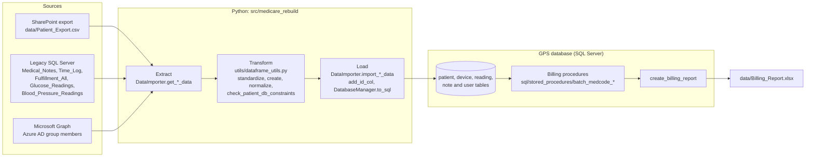
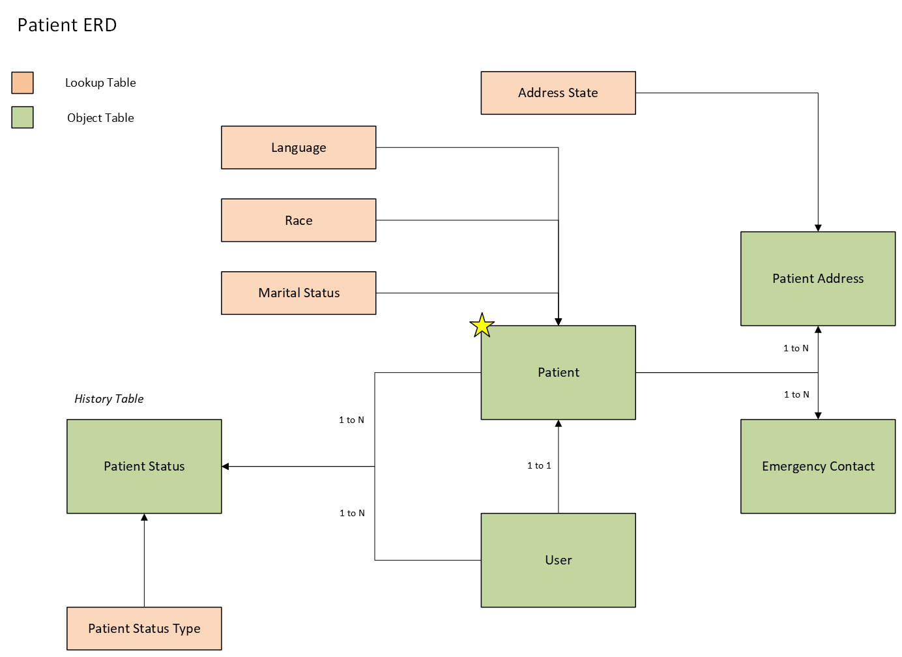
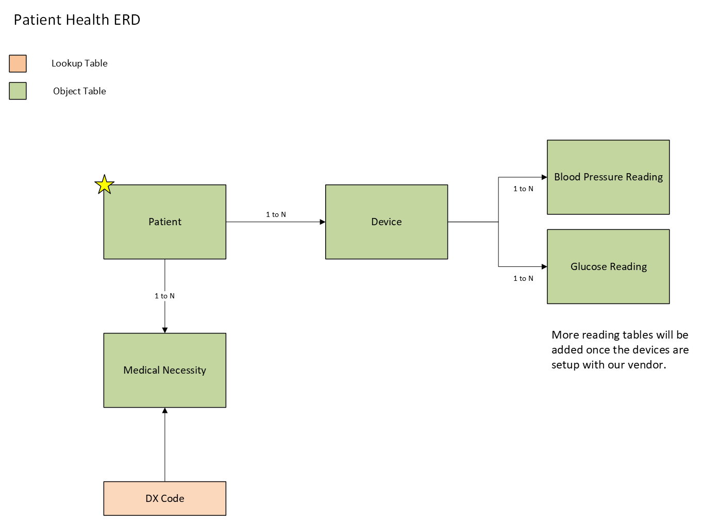
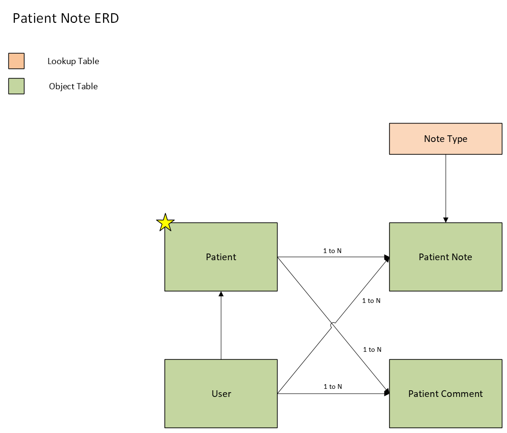
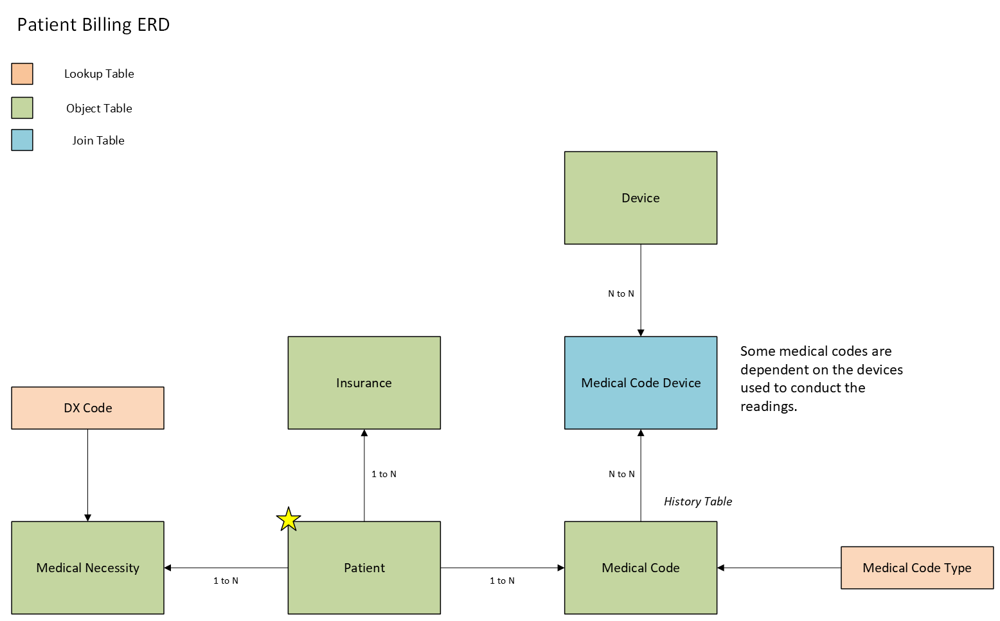
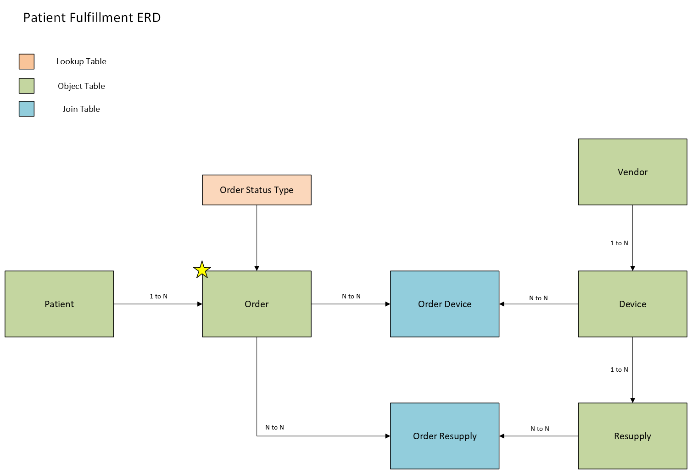

# Medicare-Rebuild

An ETL pipeline that rebuilds the data architecture for a healthcare provider's remote patient monitoring program billed to Medicare, recording an accurate 'date of service' for each billable event.

[](https://github.com/chingdrop/medicare-rebuild/actions/workflows/ci.yml)

[](LICENSE)

## About this project

- **What it does:** an ETL pipeline for remote-patient-monitoring billing. It reads patient, device, reading and note data from legacy SQL Server databases, a SharePoint list export and a Microsoft Graph user directory, standardizes it with pandas, and loads it into a new SQL Server schema that records a date of service for each billable event. Stored procedures then assign the Medicare CPT codes 99202, 99453, 99454, 99457 and 99458 and produce a billing report.
- **Context:** the work was motivated by a healthcare provider running a remote patient monitoring program billed to Medicare. This repository is a cleaned-up version of the pipeline built for that program, published as a portfolio project with client-specific material removed.
- **Data:** all data in this repository is synthetic. Test fixtures use fictional names, `example.com` emails and placeholder IDs, and the SQL files contain schema and queries only, no data.
- **Boundary:** no real patient data, credentials, tenant identifiers, or client configuration appear in the code or in the commit history of this repository's branches.
- **Try it:** run the whole pipeline on generated synthetic data with `make demo` - see [docs/demo.md](docs/demo.md).
- **More:** see [docs/provenance-and-data-boundary.md](docs/provenance-and-data-boundary.md) for provenance, the data boundary, and how to contribute test data safely.

## What it does

- **Sources in:** the patient export (a SharePoint list downloaded as `Patient_Export.csv`), five legacy SQL Server tables (`Medical_Notes`, `Time_Log`, `Fulfillment_All`, `Glucose_Readings`, `Blood_Pressure_Readings`), and the user directory from Microsoft Graph.
- **Transformation:** pandas `standardize_*`, `create_*` and `normalize_*` functions in `dataframe_utils.py`, then `check_patient_db_constraints` drops rows that would violate the target column limits.
- **Load:** `DataImporter.import_*_data` writes into the new GPS SQL Server database, swapping legacy `SharePoint_ID` and vendor names for identity keys (`add_id_col`).
- **Billing rules:** the `batch_medcode_*` stored procedures apply CPT codes 99202, 99453, 99454, 99457 and 99458 (see [docs/billing-rules.md](docs/billing-rules.md)).
- **Report out:** `create_billing_report` produces `data/Billing_Report.xlsx`, one row per patient per date of service with a count for each code.



## Try it in 60 seconds

Runs the whole pipeline on generated synthetic data: no credentials, no real data, no network during the run.

You need Docker (running), [uv](https://docs.astral.sh/uv/), `make`, and the ODBC Driver 18 for SQL Server (macOS: `brew install microsoft/mssql-release/msodbcsql18 microsoft/mssql-release/mssql-tools18`).

```sh
git clone https://github.com/chingdrop/medicare-rebuild.git
cd medicare-rebuild
uv sync
make demo
```

Expected output (trimmed; a first run also downloads the SQL Server image and Python dependencies):

```text
Synthetic demo - seed 20250228, 200 patients, 46 named scenarios
Rows: source -> loaded
  users                         8 ->     8
  patients                    200 ->   196
  devices                     109 ->   103
  glucose readings            904 ->   823
  blood pressure readings     507 ->   523
  patient notes               158 ->   153
...
Billing codes        applied   in report
  99202                  13         13
  99453                  46         44
  99454                  44         43
  99457                  34         34
  99458                  18         18
...
RESULT: PASS (27/27 checks)
Report: demo_output/Billing_Report.xlsx
```

Full output, how the demo works, and how to reset it (`make demo-down`): [docs/demo.md](docs/demo.md). To check that a run is complete and consistent: [docs/reconciliation.md](docs/reconciliation.md).

## Results

- **Demo run** (synthetic data, default seed): 196 of 200 patients loaded (4 rejected by the pipeline's constraint checks), 89 billing-report rows, and codes applied 99202 x13, 99453 x46, 99454 x44, 99457 x34, 99458 x18, with all 27 checks against the expected-results manifest passing.
- **Original scale:** approximately 22,000 Medicare-eligible patients, completed within a 3-month timeframe.

## Data model

Schema design (the pipeline populates the patient, device, reading, note and medical-code tables).



*Patient, address, emergency contacts, status history, user and lookup tables.*



*Devices, glucose and blood pressure readings, and medical necessity (diagnosis codes).*



*Patient notes and comments, by user and note type.*



*Insurance, medical codes by type, and the link between codes and devices.*



*Orders and resupply, with vendors and devices. Not loaded by this pipeline.*

## Scope

The project covers the following:

- **Extraction** - Data is extracted from various sources including SharePoint Lists and legacy SQL databases.
- **Transformation** - Data is transformed by standardizing patient billing information and instrument readings.
- **Loading** - The transformed data is loaded into a new SQL database that enforces entity relationships and accurately records the 'date of service' for billable services.

The monitoring program focused mainly on *diabetes* and *hypertension*.

### Billing rules

Stored procedures in [`sql/stored_procedures/`](sql/stored_procedures/) assign five CPT codes from the loaded data. 99453 and 99454 come from at least 16 distinct days of device readings (for 99454, within a rolling 30 days). 99457 and 99458 come from 20-minute blocks of note call time in a rolling month, with up to three 99458. 99202 comes from Initial Evaluation notes totalling 15 to under 30 minutes. Exact conditions, windows, interactions, worked examples and known gaps are in [docs/billing-rules.md](docs/billing-rules.md).

## Process

The pipeline extracts patients from a SharePoint CSV export, notes, devices and readings from legacy SQL databases, and users from Microsoft Graph. Pandas functions standardize and normalize the data, then it is loaded into a new SQL Server schema; stored procedures assign the billing codes and build the report. Stage-by-stage detail is in [docs/architecture.md](docs/architecture.md).

## Configuration

Running against real sources needs service accounts for the old and new SQL Servers, Azure AD application credentials, and a set of `GPS_SQL_*`, `LEGACY_SQL_*` and `AZURE_*` environment variables. The demo needs none of these. See [docs/configuration.md](docs/configuration.md).

## Design decisions

Why the pipeline is built the way it is - staged ETL, billing rules in stored procedures, database-assigned keys, the testing approach and more - is recorded in short decision records. See [docs/decisions/](docs/decisions/README.md).

## Security and data handling

The repository holds synthetic data only. How credentials, connections, logging and data-file guards work (and what a real deployment would still need) is in [docs/data-handling.md](docs/data-handling.md); to report a vulnerability, see [SECURITY.md](SECURITY.md).

## Tech stack

Versions come from [`pyproject.toml`](pyproject.toml).

- **Python** 3.12 or newer.
- **ODBC Driver 18**: Required for connecting to Microsoft SQL Server.
- **SQLAlchemy**: SQL toolkit and ORM. Used here for engines, sessions and raw SQL execution, not ORM models.
  - **pyodbc**: Used for ODBC connections.
- **Pandas**: A library for data manipulation and analysis.
  - **NumPy**: Numeric support for Pandas.
  - **openpyxl**: Used by Pandas for Excel file operations.
- **Requests**: A library for making HTTP requests.
- **python-dotenv**: Loads environment variables from a `.env` file.
- **colorlog**: Colored console logging.
- **certifi** and **urllib3**: TLS certificates and retry support for the REST adapter (`utils/rest_adapter.py`).

## Testing

Install dependencies with `uv sync`, then:

```sh
uv run pytest              # unit tests only (default)
uv run pytest -m integration   # integration tests only
```

Unit tests mock all external systems and need nothing else installed.

Integration tests exercise `DatabaseManager` and `DataImporter` against a real
SQL Server instance (MS Graph calls are still mocked). To run them
locally:

1. `docker compose up -d` to start a disposable SQL Server container.
2. Install the ODBC Driver 18 for SQL Server (e.g. `brew install
   microsoft/mssql-release/msodbcsql18 microsoft/mssql-release/mssql-tools18`
   on macOS, or see [Microsoft's Linux install docs](https://learn.microsoft.com/en-us/sql/connect/odbc/linux-mac/installing-the-microsoft-odbc-driver-for-sql-server)).
3. `uv run pytest -m integration`

Connection details default to the `docker-compose.yml` values and can be
overridden with `INTEGRATION_DB_HOST`, `INTEGRATION_DB_PORT`,
`INTEGRATION_DB_USER`, and `INTEGRATION_DB_PASSWORD`. Tests skip automatically
if no server is reachable. CI runs both suites on every push and pull request.
