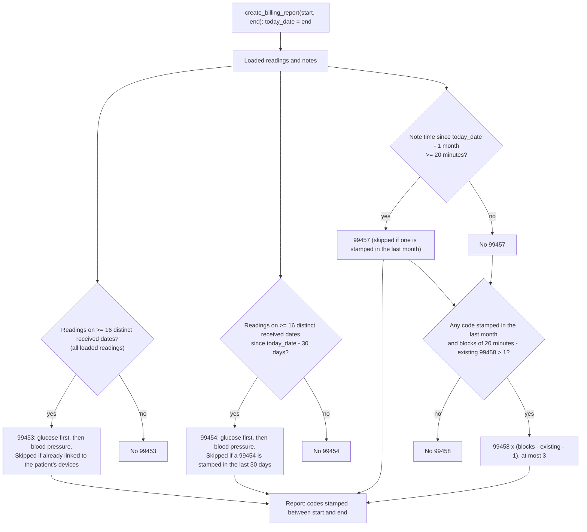

# Billing rules

## Purpose and scope

This document describes how this repository's reference implementation decides which Medicare billing codes (CPT codes 99202, 99453, 99454, 99457 and 99458) a patient earns, and what ends up in the billing report. The source of truth is the code: [`src/medicare_rebuild/billing.py`](../src/medicare_rebuild/billing.py), a faithful pandas/ORM port of the original T-SQL stored procedures in [`sql/stored_procedures/`](../sql/stored_procedures/) (kept for reference; see [decision 0014](decisions/0014-pandas-billing-rules.md)), and the tests. Where an older README or a code comment says something different, this document follows the code.

> **Not billing or compliance advice.** This describes a portfolio reference implementation and the values it uses. It is not a statement of what Medicare or any payer requires, and it must not be used to decide what to bill. Code meanings below are short paraphrases, not official descriptors.

## Rules at a glance

Every window below is measured back from `today_date`, which is the **end date of the report** (`create_billing_report(start, end)` passes `end`), not the wall-clock date. "Received date" means the calendar date of the reading's stored `received_datetime`, with no timezone conversion.

| Code | Plain-language meaning | Qualifying condition as implemented | Window | Cap | Implemented in | Pinned by |
|------|------------------------|--------------------------------------|--------|-----|----------------|-----------|
| 99202 | A new-patient office or telehealth visit, coded here from time spent in the initial evaluation | Notes typed *Initial Evaluation*: total call time of at least 900 s and under 1800 s (`FLOOR(SUM)/60` from 15 up to but not including 30 minutes). Skipped if the patient already has any of 99202-99205. Stamped at the latest such note. | None: all loaded notes | One per patient per run | [`billing.py`](../src/medicare_rebuild/billing.py) `apply_99202`, `_qualifying_by_minutes`; `normalize_patient_notes` (`dataframe_utils.py` L593, L599-604) sets nurse-practitioner time to 900 s and re-types nurse notes | Demo S18-S24; `tests/test_billing.py` |
| 99453 | Setting up a monitoring device and teaching the patient to use it | Not modelled as a setup event. Proxy: readings on at least 16 distinct received dates. Glucose is checked first, then blood pressure. The code is linked to all of the patient's devices, so the second check is skipped. Stamped at the latest reading. | None: all loaded readings | One per patient per run | [`billing.py`](../src/medicare_rebuild/billing.py) `apply_99453`, `_apply_99453_pass`, `_qualifying_by_reading_days` | Demo S01-S17; `tests/test_billing.py` |
| 99454 | Supplying the device and receiving its data for a 30-day period | Readings on at least 16 distinct received dates among readings received on or after `today_date - 30 days` (no upper bound). Glucose first, then blood pressure. Skipped if a 99454 is already stamped in the last 30 days. Stamped at the latest reading. | Rolling 30 days ending at the report end date | One per patient per run, regardless of device count | [`billing.py`](../src/medicare_rebuild/billing.py) `apply_99454`, `_apply_99454_pass`, `_qualifying_by_reading_days` | Demo S01-S17; `tests/test_billing.py` |
| 99457 | The first 20 minutes of clinical time spent managing the patient's monitoring in a month | Notes of any type or author with `note_datetime` on or after `today_date - 1 month`: `SUM(call_time_seconds) / 60 >= 20`. Skipped if a 99457 is already stamped in that window. Stamped at the latest note. | Rolling one month ending at the report end date (not a calendar month) | One per patient per run | [`billing.py`](../src/medicare_rebuild/billing.py) `apply_99457`, `_qualifying_by_minutes` | Demo S21-S22, S25-S38; `tests/test_billing.py` |
| 99458 | Each further 20 minutes of that clinical time | The patient must already have any medical code stamped in the last month. `blocks = FLOOR(seconds / 1200)` over notes in the window, capped at 4. Rows added = `blocks - existing 99458 rows - 1`, and only when `blocks - existing > 1`; at most 3 rows. So 40 minutes earns one, 60 two, 80 or more three. Stamped at the latest note. | Rolling one month ending at the report end date | Up to 3 per patient per run | [`billing.py`](../src/medicare_rebuild/billing.py) `apply_99458`, `_qualifying_99458` | Demo S30-S34, S38; `tests/test_billing.py` |

**Where tests fit.** Before the synthetic demo, no test exercised the billing rules; they could only be run end to end against a real SQL Server. The pandas port (see [decision 0014](decisions/0014-pandas-billing-rules.md)) changed that: `tests/test_billing.py` unit-tests every rule's pure computation directly, pinning the exact boundary cases in this document, without a database. The demo scenarios still cover the rules end to end through the real pipeline and database (S-numbers refer to `demo_data/manifest.json`, produced by `python -m tools.synthetic_data`; the full scenario table is in [demo.md](demo.md#scenarios)), checked by one integration test, [`tests/integration/test_demo_integration.py::test_every_named_scenario_behaves_as_designed`](../tests/integration/test_demo_integration.py) (needs a SQL Server; run with `uv run pytest -m integration`). The Python helpers that feed the rules have small unit tests: `test_standardize_call_time`, `test_standardize_note_types`, `test_standardize_vendor` in [`tests/test_dataframe_utils.py`](../tests/test_dataframe_utils.py). The nurse-practitioner and nurse re-typing in `normalize_patient_notes` is covered only by the demo (S18, S24, S37); the unit test `test_normalize_patient_notes` checks output shape only.

`call_time_seconds` (`patient_note.call_time_seconds`) is a `FLOAT` column in the schema of record ([`models.py`](../src/medicare_rebuild/models.py)), so `SUM(call_time_seconds) / 60` in the 99202 and 99457 conditions is real division, not integer division (an earlier revision of this document said otherwise); the scenarios sit on whole-minute boundaries, where integer and real division agree regardless. 99202 floors the summed seconds before dividing (`FLOOR(SUM(...))/60`); 99457 does not (`SUM(...)/60`) -- a real difference between the two conditions, preserved in `billing.py`'s `_qualifying_by_minutes` via its `floor_seconds` argument.

## How the rules interact

`create_billing_report()` (`__main__.py`) calls `billing.run_billing()`, which runs every rule in a fixed order (the same order `create_billing_report()` used to call the stored procedures in), then `billing.build_billing_report()` builds the report:

1. `clear_medical_codes` clears every previously computed code.
2. `apply_99202`
3. `apply_99453` (glucose pass, then blood pressure pass)
4. `apply_99454` (glucose pass, then blood pressure pass)
5. `apply_99457`
6. `apply_99458`
7. `build_billing_report`

| Interaction | What the code does |
|-------------|--------------------|
| Recomputed every run | Step 1 deletes all codes, so "already has a code" checks only see codes created earlier in the same run. There is no memory of earlier billing periods. |
| Glucose before blood pressure (99453) | The glucose procedure links its 99453 to all of the patient's devices. The blood pressure procedure skips any device already linked, so a patient with both device types gets one 99453 (demo S07). |
| Glucose before blood pressure (99454) | After the glucose procedure stamps a 99454, the blood pressure procedure sees one inside the last 30 days and skips. One 99454 per patient. |
| 99453 and 99454 are independent | Neither requires the other. A patient with 16 distinct days in the last 30 days gets both (S01). A patient whose 16 days start just outside the 30-day window gets 99453 only (S09). |
| 99202 and 99457 both count Initial Evaluation time | Initial Evaluation notes are ordinary notes for 99457. A 1799 s initial evaluation earns both 99202 and 99457 (S21); an 1800 s one earns 99457 only (S22). |
| 99202 exclusion of 99203-99205 | The procedure skips a patient who already has 99202, 99203, 99204 or 99205. Nothing in this repo assigns 99203-99205 and codes are cleared each run, so in practice this only prevents a second 99202 in one run. |
| 99458 needs another code, not specifically 99457 | The `med_code_count` join requires any code stamped in the last month. Because 99457 runs first, a patient with 40 or more minutes normally has one. The procedure never checks for 99457 itself. |
| 99458 subtracts existing 99458 rows | Rows added = target minus 99458 rows already present in the last month, so the procedure limits itself if run twice without a reset. The normal flow resets first, so each run starts from none. |
| Same patient, same day | The report groups by patient and by the date part of each code's timestamp, so codes stamped on the same date share one row with a count per code (S38: one row carrying 99453, 99454, 99457 and 99458). |

## Decision path for the monitoring codes

## Worked examples

All values come from the generator's manifest and source files for the default seed (`20250228`), and the demo run checks them (`make demo`). The report end date is 2025-02-28, so the 30-day window starts 2025-01-29 and the one-month window starts 2025-01-28.

1. **Just at and just above the reading threshold (S01, S03).** Patient 1001 has readings received on 16 distinct dates, 2025-02-03 to 2025-02-18, and earns 99453 and 99454, both stamped 2025-02-18 18:10:00 (the latest reading). Patient 1003 has 17 distinct dates and earns both, stamped 2025-02-19 19:53:00.
2. **Just below (S02, S30).** Patient 1002 has readings on 15 distinct dates and earns nothing. Patient 1030 has 2340 s of notes (39 minutes) and earns 99457 only. Patient 1031 has 2400 s (40 minutes) and earns 99457 plus one 99458.
3. **The rolling window (S08, S09).** Patient 1008's 16 days start on 2025-01-29, the first day inside the 30-day window, so 99453 and 99454 are both earned (stamped 2025-02-13 09:20:00). Patient 1009's 16 days start one day earlier, on 2025-01-28; only 15 of them fall inside the window, so 99454 is not earned and only 99453 is (stamped 2025-02-12 18:17:00). The rules use reading dates only; the enrollment date is not used (see [Known gaps](#known-gaps-and-assumptions)).
4. **Duplicate readings (S11).** Patient 1011 has 32 reading rows, every reading present twice, on 16 distinct dates. The pipeline loads all 32 rows unmerged, and the rules count distinct dates, so the patient earns 99453 and 99454 once each (stamped 2025-02-20 12:56:00).
5. **Duplicate notes (S35).** Patient 1035 has one 600 s note present twice. Nothing removes the duplicate, so 1200 s is counted and the patient earns 99457 (stamped 2025-02-11 10:15:00). A single copy would not qualify.

## Data quality handling

Problems are handled quietly: rows are dropped or nulled, not flagged. Nothing in the report marks them; they show up only as absence. The demo's summary lists rejected patients, with reasons taken from its manifest rather than from the pipeline.

| Problem | What happens | Where | Demo |
|---------|--------------|-------|------|
| Patient row breaks a column limit: phone over 11 digits, SSN over 9, state over 2 characters after normalization, ZIP over 5, emergency phone over 11, Medicare ID over 11, payer ID over 30 | Patient dropped, silently, together with their devices, readings and notes (those cannot find a patient to link to) | `check_patient_db_constraints` (`dataframe_utils.py` L722-732); `_drop_unresolved` (`__main__.py`) | S39-S42 |
| Notes, devices or readings for an ID with no patient row | Dropped the same way | `_drop_unresolved` (`__main__.py`) | S46 |
| Readings for a patient with no device | Dropped (readings are linked through the device table) | `import_gluc_readings_data`, `import_bp_readings_data` (`__main__.py`) | S16 |
| Device flagged as a resupply, or vendor other than Tenovi or Omron | Excluded by the source query | `queries.py` L22 | S17 |
| Readings or notes recorded after midnight at the start of the end date | Never extracted (the extract window is `<=` the end date at 00:00:00) | `queries.py` L5, L11, L28, L39 | S14 |
| A reading recorded before the cutoff but received after it | Loaded; its date counts as the received date, so a code can be stamped after the report end and fall outside the report | `billing.py` `_in_report_window`, `build_billing_report` | S13 |
| Malformed email | Stored as NULL; patient still loads | `standardize_email` | S43 |
| Blank diagnosis codes | Patient loads with one blank diagnosis row and still appears in the report with an empty `DXCodes` | `standardize_dx_code` (L144-158), `create_med_necessity_df` (L409-413) | S45 |
| Notes with no time-log entry | Call time is NULL and adds nothing to any total | left merge in `get_patient_note_data` | S36 |
| Readings with NULL values | Still count as a day; `billing.py` counts dates, not values | `billing.py` `_qualifying_by_reading_days` | S15 |
| Manual readings | Counted like device-transmitted ones; `billing.py` never looks at `is_manual` | `billing.py` `_device_readings` | (none) |
| A patient with no address, insurance or diagnosis-code row | Omitted from the report by inner joins, even if codes were applied | `billing.py` `build_billing_report` | (none) |
| A failing billing computation | Raises and stops the run -- no exception is swallowed (see [decision 0014](decisions/0014-pandas-billing-rules.md), a change from the stored procedures this replaced, which `DatabaseManager.execute_query` logged and returned from without raising) | `billing.py` | (demo counts logged errors) |

## Known gaps and assumptions

Taken from the code and its comments:

- **Enrollment and first-service dates are not used, though they should limit eligibility.** `On-board Date` is loaded into `medical_necessity.evaluation_datetime` and no procedure reads it. A patient who joins mid-period is treated like any other: only reading dates and note times matter. As intended, a patient's date of service should only be able to be billed for the 30 days following that date; this implementation has no such limit.
- **"Day" has no timezone.** The date of a reading is `CAST(received_datetime AS DATE)` on the stored value, with no conversion.
- **Rolling windows, not calendar months, and this is intentional.** 99457 and 99458 look back one month from the report end date, so a window ending 2025-02-28 includes notes from 2025-01-28 (S28). The 99454 window is 30 days, also rolling. This is deliberate: this project exists because the source system had been marking the first of the month as the date of service for every patient regardless of when service actually occurred, and rolling windows anchored to the actual report end date were built specifically to replace that practice.
- **No memory across billing periods.** Codes are deleted and recomputed each run (`reset_medical_code_tables`), and 99453 has no window. A patient with 16 loaded days of readings would be given 99453 again in a later run. For one-time codes like 99453 and 99202, a real deployment should prevent this with a persistent flag on the patient record marking that code as already billed, rather than checking the full billing history on every run.
- **99453 is a proxy.** It is awarded on reading days, not on a recorded device setup or patient education event.
- **Any note counts toward 99457 and 99458, but internal notes should be excluded.** Minutes are summed across every note type and author, with no check for interactive contact with the patient or for who wrote the note. As intended, all notes except internal notes should count toward billed time. There is no "internal" note type in the schema or lookup tables this repository defines, so this distinction is not enforced anywhere in the code.
- **Manual readings count** (see above), and this is intended: manually entered readings should count toward the 16-day threshold the same as device-transmitted ones.
- **99202 is inferred from time alone, and a call of 30 minutes or more should map to a higher code.** A patient is given 99202 for 15 to under 30 minutes of Initial Evaluation notes, and nothing here assigns 99203-99205, so 30 minutes or more gets no visit code at all (S22) even though it should be billed as one of those higher codes. Nurse-practitioner note time is forced to 15 minutes regardless of what was logged (S18). The 30-minute target existed operationally because nursing staff were encouraged to keep the initial consultation call to 30 minutes so they could meet the volume of all the patients; this implementation reflects that target but never implements the higher codes a longer call should escalate to.
- **The 99458 cap of three** matches the README's original wording and the procedure's numbers table (1, 2, 3). The author's understanding is that CMS caps 99458 at three additional units within a billing period, which matches the secondary sources found below, though this repository does not cite a primary CMS source for it.
- **`main()` does not import notes.** Commit `d229b65` (2025-03-06, "move all driving funcs to main") moved the driving functions into `__main__.py` and left out the patient-note import that the earlier `import_to_sql.py` (since removed) had. A run through `main()` therefore cannot produce 99202, 99457 or 99458. The demo calls the note steps itself ([demo.md](demo.md#what-is-reconstructed-or-replaced)).
- **`batch_medcode_99454.sql` was never run, even before decision 0014.** It is an older combined version (readings from either table, joined with `LEFT JOIN`). The pipeline called the `_bg` and `_bp` versions, and `billing.py` ports only those two (`_apply_99454_pass`, called once per reading model). The `sql/queries/test_medcode_*.sql` files were scratch queries, not tests, and were never run by the pipeline or CI; nothing in `billing.py` corresponds to them.
- **Multi-device patients get duplicated readings.** Readings are joined to the device table on `patient_id`, so every reading is loaded once per device. Distinct-day counts are unaffected (S07).
- **Payer-specific checks are absent.** Nothing here checks coverage, medical necessity, ordering-provider requirements, frequency limits across providers, or claim edits.

### External context (research, not implementation)

Added while reviewing this document for accuracy. It is background from secondary sources, not a claim about this code, and none of it was verified against payer policy.

- CMS's CY 2021 fee schedule fact sheet says 16 days of data in each 30-day period must be collected and transmitted to bill 99453 and 99454 ([CMS](https://www.cms.gov/newsroom/fact-sheets/final-policy-payment-and-quality-provisions-changes-medicare-physician-fee-schedule-calendar-year-1)). This implementation applies the 30-day window to 99454 only; 99453 has none.
- Secondary sources describe 99457 and 99458 as calendar-month services ([AAPC on 99457](https://www.aapc.com/codes/cpt-codes/99457), [Find-A-Code on 99458](https://www.findacode.com/cpt/99458-cpt-code.html)). This implementation uses a rolling one-month look-back.
- Guidance for the additional-minutes code varies between sources on how many units are allowed per month or per day, so the cap of three should be checked against a current source.
- The AMA's summary of the CY 2026 fee schedule final rule lists new and revised remote physiologic monitoring codes 99445 and 99454 ([AMA summary](https://www.ama-assn.org/system/files/2026-mpfs-final-rule-summary-analysis.pdf)). Secondary sources describe a lower day-count tier and a shorter management-time code from 2026. This implementation was built for the 2025/2026 CPT code set as coded here (99453, 99454, 99457, 99458) and does not reflect the CY 2026 revisions.
- Secondary sources say that from 2024 the American Medical Association's office-visit time thresholds are stated as minimums rather than ranges, which would affect the 15 to under 30 minute band used for 99202.
- Secondary sources say device data should be automatically transmitted, which bears on counting manual readings.

## As of

This document reflects the code as of the commit that ported billing computation to pandas (decision 0014). No billing *rule* has changed since `fd284b2` (2026-09-21), when this document was first written -- decision 0014 is a technology migration, verified against the demo's pre-existing report content hash, not a rules rewrite. This revision updates every evidence pointer from `.sql` line numbers to `billing.py` functions, and corrects a stale claim that `call_time_seconds` is an `INTEGER` column (it is `FLOAT`; see decision 0014's Consequences). Payer and CMS rules change; this describes what the implementation does, not current policy.
